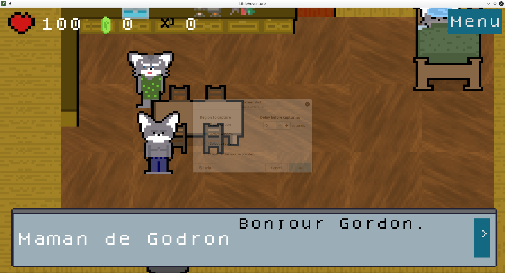
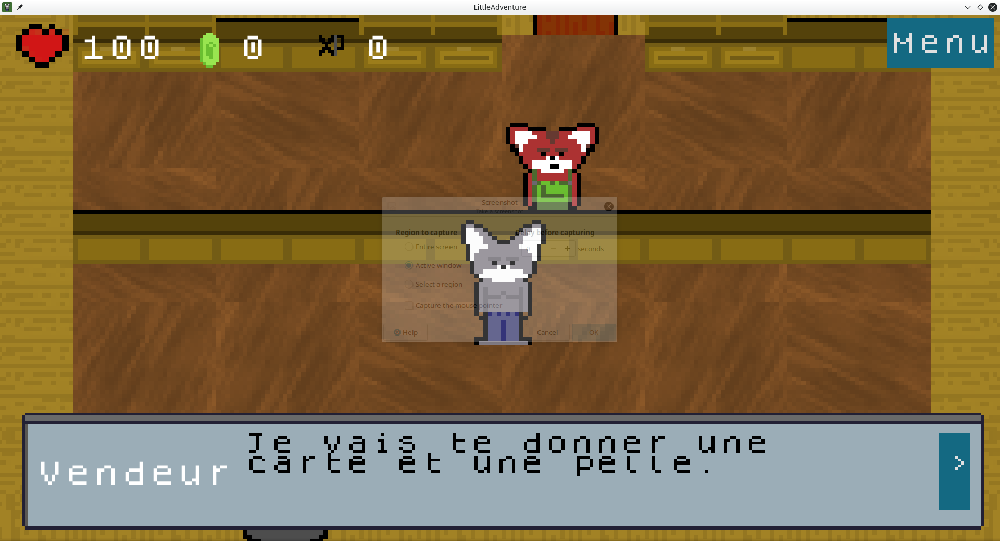
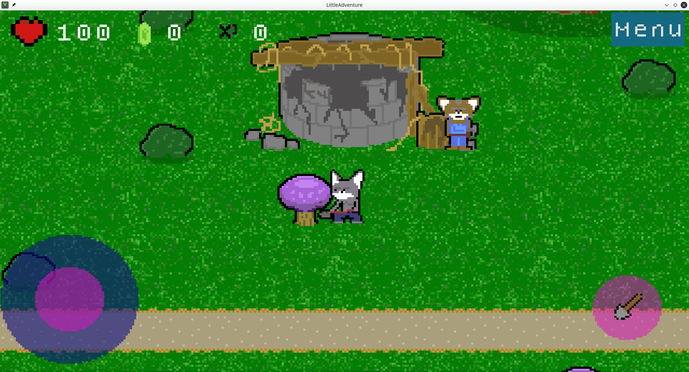
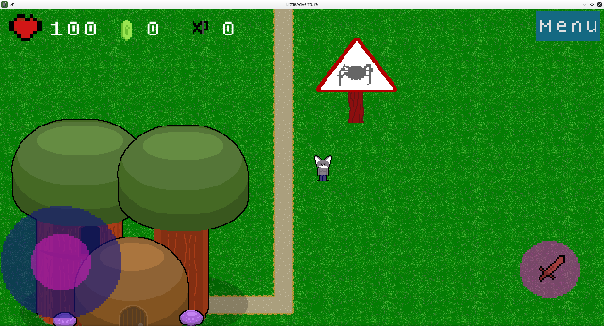
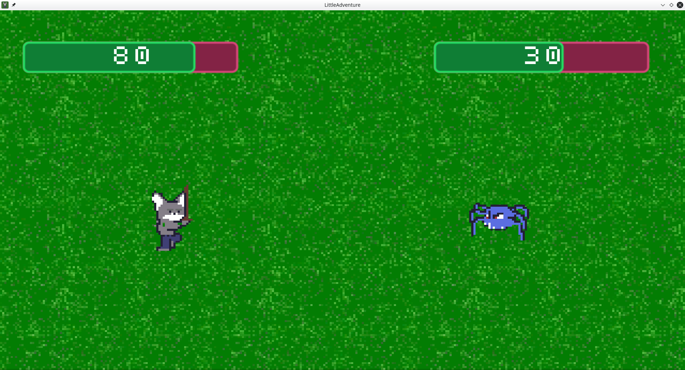
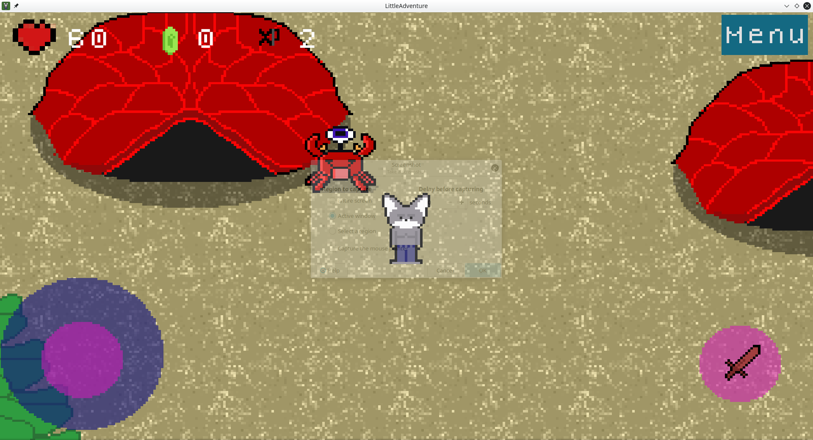

<div align="center">


# 🗡️ Little Adventure

**A little pixel art RPG where Gordon sets out to repair his village's well.**

Free · Linux, Android, Windows & Web · Made with Godot 4

[](https://flathub.org/apps/org.dupot.littleadventure)
[](https://godotengine.org)
[](LICENSE)

<a href="https://flathub.org/apps/org.dupot.littleadventure"></a>

</div>

---

## 📖 About

The village well is broken, and **Gordon** is the one who has to fix it. To find the missing pieces, he'll have to leave home and explore the world.

- 🏡 **Explore**: walk around the village, talk to its inhabitants and find your way with the map
- 🛒 **Shop**: buy a sword, potions and tools from the merchant
- 🕷️ **Fight**: face spiders, crabs and other monsters roaming outside the village
- 🗺️ **Travel**: visit the tree village, the bear village and the crab village to gather every piece of the well

## 📸 Screenshots

<div align="center">

| At home | The merchant | The broken well |
|:---:|:---:|:---:|
|  |  |  |
| **Into the forest** | **Fighting a spider** | **The crab village** |
|  |  |  |

</div>

## 🎮 Controls

| Action | Keyboard |
|---|---|
| Move | Arrow keys |
| Talk / Attack / Confirm | `Enter` or `Space` |
| Menu | `Escape` or `Backspace` |

🎮 Gamepads are supported too, and Android gets on-screen touch controls (virtual joystick and action button).

## 📦 Install

### Flathub (Linux, recommended)

```bash
flatpak install flathub org.dupot.littleadventure
flatpak run org.dupot.littleadventure
```

You can also install it from GNOME Software, KDE Discover or any app store that uses Flathub. The Flatpak metadata lives in [export/linux/flatpak](export/linux/flatpak).

## 🛠️ Build from source

1. Install [Godot 4.7](https://godotengine.org/download/) or later.
2. Clone the repository:
   ```bash
   git clone https://github.com/imikado/dupotLittleAdventure.git
   ```
3. Open `project.godot` in Godot and press **F5** to play.

Export presets for **Linux**, **Windows**, **Android**, **Android Fire TV** and **HTML5** are included in `export_presets.cfg`. For Android TV specific changes, see [help/androidTv.txt](help/androidTv.txt).

### Tests

Unit tests use [GUT](https://github.com/bitwes/Gut) and live in [test/](test/). Run them with:

```bash
./unitTest.sh
```

(`unitTest.sh` expects a `godot` 4 binary in your `PATH`; tests are configured in `.gutconfig.json`.)

## 🕹️ More from dupot.org

Also on Flathub from the same developer:

- **[Save the Sheep](https://github.com/imikado/dupotSaveTheSheep)**
- **Beat And Match To Pass**
- **Easyflatpak**

See them all on [dupot.org](https://www.dupot.org/games.html).

## 🐛 Feedback

Found a bug or have an idea? [Open an issue](https://github.com/imikado/dupotLittleAdventure/issues).

## 📜 License

This game is released under the [GNU LGPL v2.1](LICENSE).

---

<div align="center">

Made with ❤️ and [Godot Engine](https://godotengine.org) by [Michael Bertocchi](https://www.dupot.org/games.html) · [dupot.org](https://www.dupot.org)

</div>
